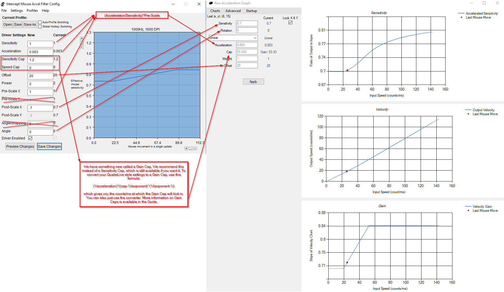

# Raw Accel: Frequently Asked Questions
See the Guide to understand all options and features in-depth.

## What are the differences between Raw Accel and InterAccel?
- The sensitivity field in InterAccel, which was useful for converting from Quake's `cl_mouseAccel`, is not in Raw Accel.
- Raw Accel uses a new kind of cap by default, see the [guide](Guide.md#caps) for more information. The old style is available for those who want it.
- Raw Accel uses a new kind of offset. The difference is subtle in most cases, and ensures a continuous transition at speeds around the offset.
- There are many new features and curve types available. See the [guide](Guide.md) for information on all of these.

## How do I convert InterAccel settings to Raw Accel?
Drag 'n drop your InterAccel profile/settings.txt onto `converter.exe`. For GUI differences see the image below:

See the guide to understand more about the Gain Cap option and other new features! 

## Does this driver work with AntiCheat?
Yes. That is one of the fundamental goals of this driver. It is fully signed and has a one-second delay on write, so it cannot be used to cheat and should be considered safe by AntiCheat programs. However, we can never guarantee that the humans in control over AntiCheat code make the right decisions. So far it is working in FaceIT, Valorant, and Diabotical matches.

## How do I install the driver, uninstall the driver, or start the GUI?
Instructions for these are in the beginning of the [guide](Guide.md#installation).

## Does the GUI need to be running for Raw Accel to work?
No. Once settings are passed to the driver by the GUI, they stay in use until the computer is shut down.

## Does the GUI need to be run every time I start my PC?
Yes. The driver itself does not store your settings. To enable them on PC start, run the GUI, or run `writer.exe settings.json`.

## I don't understand something, or have some other question.
Read the guide to see if it answers your question. If not, join our [Discord](https://discord.gg/7pQh8zH) and ask.